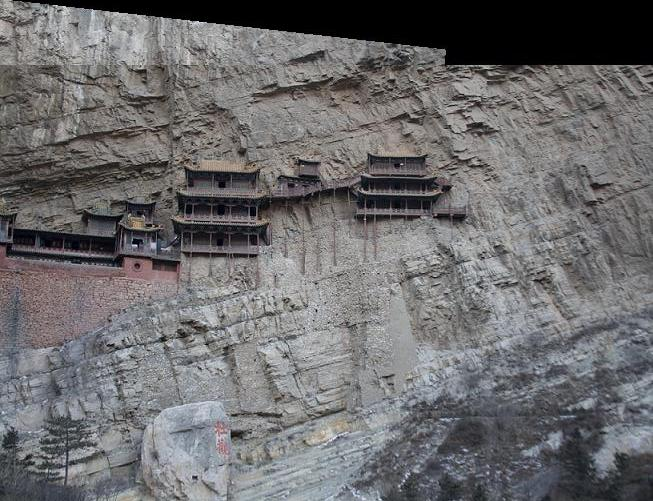
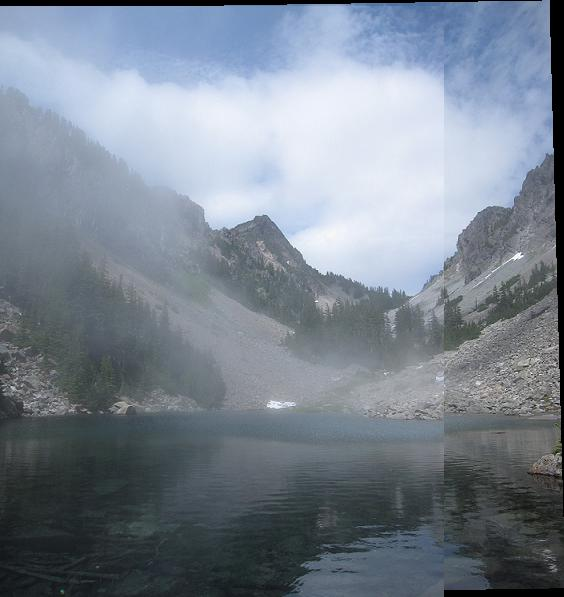
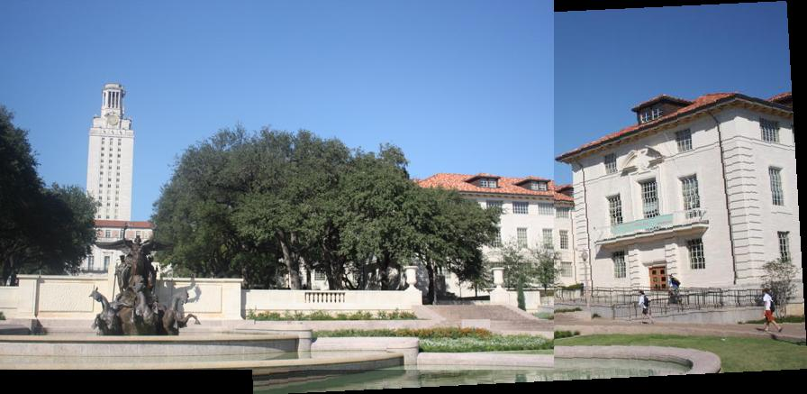
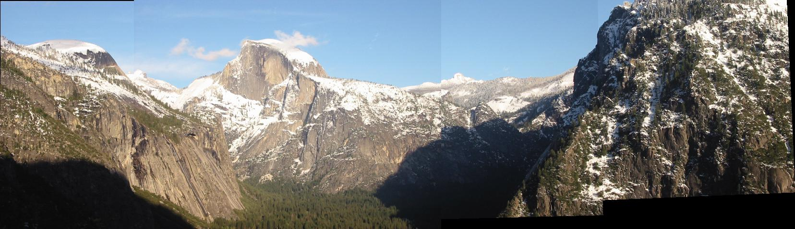
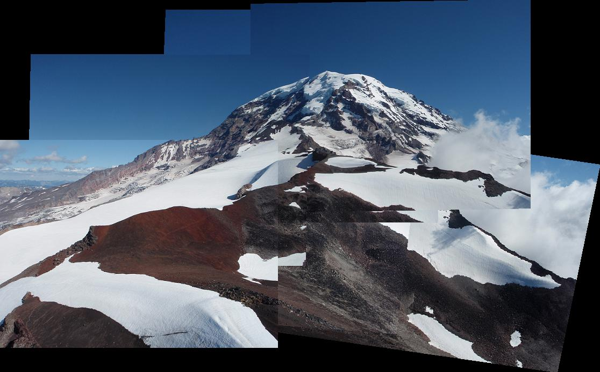
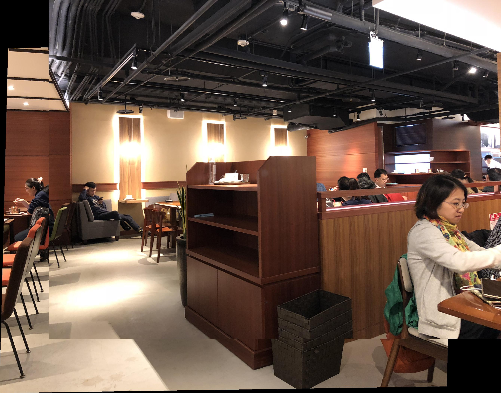

# Panorama Stitching

## Overview
The project is related to **Panorama stitching** and involve several tasks:
* Detect SIFT points and extract SIFT descriptor for each keypoint in an image using vlfeat.

* Compare two sets of SIFT descriptors coming from two different images and find matching keypoints (SIFTSimpleMatcher.py).

* Given a list of matching keypoints, use least-square method to find the affine transformation matrix that maps positions in image 1 to positions in image 2 (ComputeAffineMatrix.py).

* Use RANSAC to give a more robust estimate of affine transformation matrix (RANSACFit.py).

* Given that transformation matrix, use it to transform (shift, scale, or skew) image 1 and overlay it on top of image 2, forming a panorama.

* Stitch multiple images together under a simplified case of real-world scenario ('MultipleStitch.py').

## Implementation
1. Matching SIFT Descriptors (`SIFTSimpleMatcher.py`)</br>
The main focus is to calculate the Euclidean distance between descriptor1 and descriptor2. To implement this, we use 
the native function *tile* from *numpy* to efficiently collect every pair of distance.

```
    for i in range(descriptor1.shape[0]):
        Tile = np.tile(descriptor1[i,:],(descriptor2.shape[0],1))
        Euclid = np.sqrt(np.sum((Tile-descriptor2)**2, axis=1))

        if sorted(Euclid)[0] < sorted(Euclid)[1]*THRESH:
            match.append([i,np.argmin(Euclid)])
```

2. Fitting Transformation Matrix(`ComputeAffineMatrix.py`)</br>
In order to solve the unknown H in equation **H*P1=P2**,we should transform the format which can be processed by 
python, such as **P1'*H'=P2'**. Next we use the *numpy* function *numpy.linalg.lstsq* to solve least square x in 
Ax=b.

```
    H = np.linalg.lstsq(P1.T,P2.T)[0].T
```

3. RANSAC(`RANSACFit.py`)</br>
Compute the error using H to transform the the pixel in pt1 to the corresponding indices in pt2.
Calculate the Euclidean distance between transformed point from Image 1 **(H*P1)** and match from Image 2.


4. Stitching Multiple Images(`MultipleStitch.py`)</br>
Transformation matrix of neighboring images image{i} and image{i+1} is used to convert the coordinate frame of 
image{i} to image{i+1}.When refFrameIndex is larger than currentFrameIndex, the transformation matrix will be directly the 
product of a series of neighboring transformation matrices,but when refFrameIndex is smaller than currentFrameIndex, transformation 
the neighboring transformation matrices should be inversed before matrix multiplication.

```
    for i in range(refFrameIndex, currentFrameIndex, -1 + 2*(currentFrameIndex > refFrameIndex)):
        if currentFrameIndex < refFrameIndex :
            T = np.matmul(T, i_To_iPlusOne_Transform[i-1])
        elif currentFrameIndex > refFrameIndex :
            T = np.matmul(T, np.linalg.inv(i_To_iPlusOne_Transform[i]))
```

## Installation
Prerequired packages: Anaconda python 3.6.Install cyvlfeat for fetching sift features: 
        ```conda install -c menpo cyvlfeat ```

### Results

<table>
<tr>
Hanging</br>


Melakwa Lake</br>


UT Tower</br>


Yosemite</br>


Rainier</br>
 
    
* My Image</br>
 
</tr>
</table>
